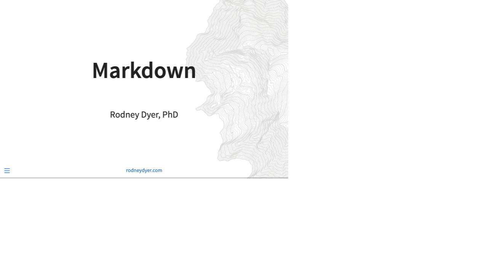

# Generating Slide Preview Images

## Quick Start

To generate a preview image of the title slide:

```bash
./capture-title-slide.sh
```

This creates `media/slides-preview.png` at 1920x1080 (16:9 aspect ratio).

## Custom Aspect Ratios

### Common Presets

```bash
# 16:9 HD (default)
./capture-title-slide.sh 1920 1080

# 16:9 smaller (for web embeds)
./capture-title-slide.sh 1280 720

# 4:3 traditional
./capture-title-slide.sh 1024 768

# 16:10 widescreen
./capture-title-slide.sh 1920 1200

# Square (for social media)
./capture-title-slide.sh 1200 1200

# Ultra-wide 21:9
./capture-title-slide.sh 2560 1080
```

## How It Works

1. Renders `slides.qmd` to HTML using Quarto
2. Uses Chrome headless mode to capture a screenshot
3. Saves the image to `media/slides-preview.png`

## Requirements

- Quarto (already installed)
- Google Chrome (already installed at `/Applications/Google Chrome.app`)

## Usage in narrative.qmd

The generated image is used as a clickable link to the full slides:

```markdown
[{fig-alt="Presentation slides"}](https://dyerlabteaching.github.io/Markdown/slides.html)
```

## Automating Updates

Add to your build process to regenerate the preview whenever slides change:

```bash
# In your workflow
quarto render slides.qmd
./capture-title-slide.sh 1280 720
quarto render narrative.qmd
```

## Troubleshooting

- **GPU error messages**: These are harmless warnings from Chrome headless mode
- **Permission denied**: Run `chmod +x capture-title-slide.sh`
- **Slides not rendering**: Ensure `slides.qmd` renders successfully first
